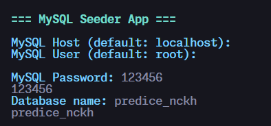

# 📦 Predice DB Seeder

A simple **database seeder** for the Predice project using **MySQL**.  
This tool helps developers quickly populate their local database with **dummy data** for testing and development.

---

## ✨ Features

- 🌱 Auto-seeds **dummy data** into MySQL
- 🔧 Easy to configure database credentials
- 🎨 Pretty logs with colors (using `chalk`)
- ⚡ Fast seeding with `mysql2`

---

## 📥 Installation

Install globally (recommended for CLI use):

```bash
npm install -g predicedbseeder
```

You may need to create your MySQL database first, name it whatever you want (eg. `predice`, `predice_db`, etc.)

The package will ask you for **host name, database name, user name and password**.



Please provide it carefully.
